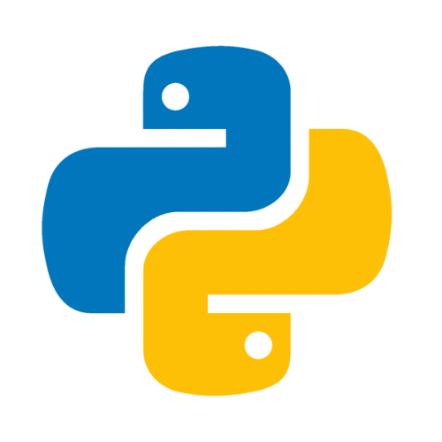
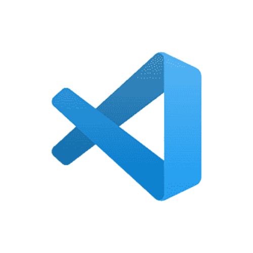
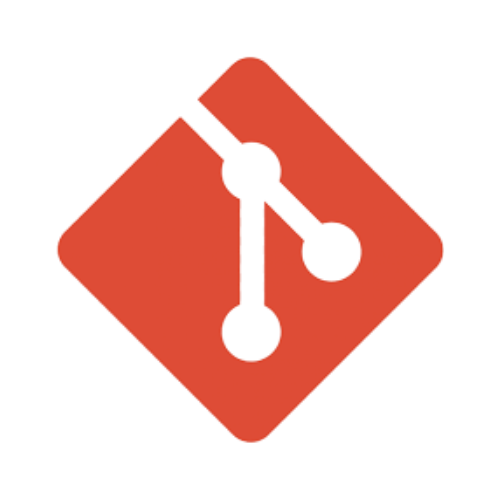

<h1>FlyFood</h1>

    <strong>Nome da Aplicação:</strong> Fly Food 
    <strong>Integrantes:</strong> <a href="https://github.com/Felipecs22">Felipe Cavalcante</a>, <a href="https://github.com/GustavoSantosgcs">Gustavo Santos</a> e <a href="https://github.com/pedroailton">Pedro Ailton</a> 
    <strong>Professor:</strong> Cícero Garrozi 
    <strong>Disciplina:</strong> Projeto Interdisciplinar para Sistemas de Informação 2 
    <strong>Curso:</strong> Bacharelado em Sistemas de Informação 
    <strong>Unidade de Ensino:</strong> Universidade Federal Rural de Pernambuco (UFRPE) 

O Flyfood é uma ferramenta de linha de comando que fornece ao usuário a rota mais rápida para as entregas dos drones FlyFood dada uma matriz como entrada em arquivo .txt que configura o mapa da região de entrega.

<h2>Ferramentas Utilizadas</h2>
<table>
    <tr>
        <td> Python 3</td>
        <td>Linguagem de programação</td>
    </tr>
    <tr>
        <td> VSCode</td>
        <td>IDE de desenvolvimento do código-fonte</td>
    </tr>
    <tr>
        <td> Git</td>
        <td>Versionamento de código</td>
    </tr>
    <tr>
        <td> GitHub</td>
        <td>Repositório e cooperação no desenvolvimento</td>
    </tr>
</table>

<h2>Bibliotecas Utilizadas</h2>
<table>
    <tr>
        <td>time</td>
        <td>Medição do tempo de execução do programa (cronômetro).</td>
    </tr>
    <tr>
        <td>itertools</td>
        <td>Geração de todas as permutações de rotas possíveis para a implementação do algoritmo de força bruta.</td>
    </tr>
    <tr>
        <td>csv</td>
        <td>Leitura e manipulação de arquivos no formato CSV.</td>
    </tr>
</table>

<h2>Instalações e Execução</h2>

O projeto utiliza apenas bibliotecas padrão do Python, portanto, a única instalação necessária é a do <strong>Python 3</strong>. Nenhum pacote adicional precisa ser instalado via <code>pip</code>.

Para executar o programa, utilize o seguinte comando no terminal, dentro da pasta do projeto:

<pre><code>python main.py</code></pre>

Após a execução, o programa solicitará o caminho para o arquivo de entrada (ex: <code>entrada.txt</code>).

<h2>Próximos Passos</h2>

Conversão para uma aplicação web com HTML, CSS e JavaScript.

